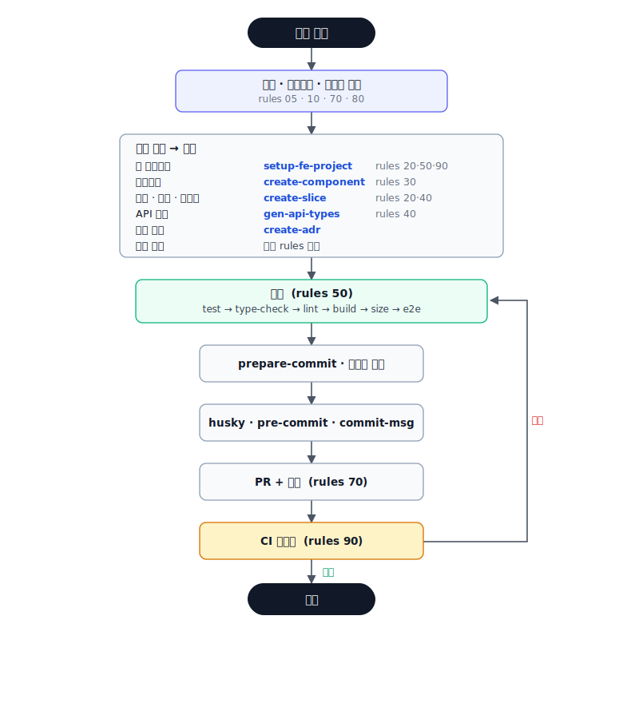
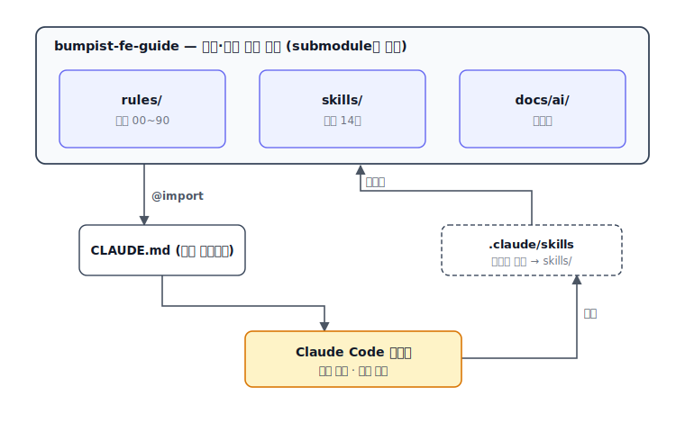

<p align="center">
  
</p>

<p align="center">
  
  
  
  
  
  
</p>

# Bumpist Code — 프론트엔드 작업 가이드

> 👋 **개발이 처음이거나 비개발자라면 → [쉬운 설명 먼저 보기](./비개발자-가이드.md).**
> 이 아래 문서(README)는 개발자용입니다.

이 저장소는 내가 프론트엔드를 만들 때 지키는 규칙과, 그 규칙을 실제 작업으로 옮겨 주는
Claude 스킬을 모아 둔 곳이다. 사람이 읽어도 되고, Claude Code가 작업 전에 읽기도 한다.

어떤 프로젝트를 만들든 폴더 구조, 컴포넌트 작성법, 테스트, 커밋 방식을 일관되게 유지하는 게 목표다.
규칙을 다 외우지 않아도 매번 같은 퀄리티로 작업할 수 있다.

> 🎨 **디자인은 [impeccable](https://github.com/pbakaus/impeccable)과 페어링한다.** 여기선 디자인 *기본선*
> (뉴트럴·플랫·브랜드 컬러·접근성)만 잡고, *심화 craft*(polish·critique·typeset·motion)는 impeccable에
> 맡긴다. 둘 다 `.claude`에 두면 **구조·품질은 bumpist-code, 디자인 미감은 impeccable**이 맡는다.

> 용어(컴포넌트·슬라이스·커밋·PR·CI…)가 낯설면 [glossary.md](./glossary.md)를 참고한다. 쉬운 말로 풀어 뒀다.

## 바로가기

[다른 프로젝트에 적용](#다른-프로젝트에-적용하기-npx) ·
[버전 관리](#버전-관리-semver) ·
[처음 오셨다면](#처음-오셨다면) ·
[작업 흐름](#작업은-이렇게-흐른다) ·
[시나리오별 활용](#시나리오별-활용) ·
[디자인 지향](#디자인-지향) ·
[스택](#스택) ·
[라이브러리 & 툴](#라이브러리--툴) ·
[규칙](#규칙-rules) ·
[스킬](#스킬-skills) ·
[참고 템플릿](#참고-템플릿-docsai) ·
[동작 방식](#이-저장소가-실제로-동작하는-방식)

## 다른 프로젝트에 적용하기 (npx)

> 사용법만 필요하면 이 섹션만 읽으면 된다. 배경·규칙 설명은 아래에 이어진다.

**명령 한 줄**이면 규칙·스킬이 내 프로젝트의 `.claude/`로 복사되고 `CLAUDE.md`까지 배선된다. 서브모듈·수동
복사 없이 `npx` 하나로 끝나고, 복사본이라 내 repo에 종속되지 않는다. 프레임워크(**Vue**/**React**/**Next.js**)를
인자로 주거나, 생략하면 `package.json`에서 자동 감지한다.
(자세한 절차는 [install.md](./install.md))

### 시나리오 A — 기존 프로젝트에 얹기 (내 프로젝트에 이미 코드가 있음)

가이드·스킬만 추가되고 **기존 코드는 건드리지 않는다.**

```sh
cd 내프로젝트
npx bumpist-code@latest init vue     # vue | react | next (생략하면 package.json에서 자동 감지)
git add .claude docs/ai CLAUDE.md && git commit -m "chore: adopt bumpist-code guide"
```

- `.claude/skills`·`.claude/rules`·`docs/ai` 복사 + `.claude/.guide-version` 기록
- `CLAUDE.md`가 없으면 @import 블록과 함께 생성, 있으면 추가할 줄만 출력
- 확인: `ls .claude/skills/`

> 버전 고정: `npx bumpist-code@0.1.0 init vue`. npm 없이 쓰려면
> `npx degit parksubeom/bumpist-fe-guide#v0.1.0 .bumpist && sh .bumpist/apply-to-project.sh vue .bumpist v0.1.0 && rm -rf .bumpist` 도 된다.

### 시나리오 B — 새 프로젝트를 처음부터 (빈 폴더)

빈 폴더에서 위 A를 먼저 실행한 뒤, Claude Code에서 **"새 프로젝트 셋업해줘"** →
`setup-fe-project`가 (Vue/React 확인 후) pnpm+Turborepo 모노레포·품질 게이트·테스트 툴링을 세우고
`BaseButton`·예시 슬라이스를 심는다. 마지막으로:

```sh
pnpm install && pnpm run lint && pnpm run type-check && pnpm run test && pnpm run build
git add -A && git commit -m "chore: bootstrap with bumpist-code guide"
```

이후 개발: "회원 목록 화면 만들어줘" 식으로 말하면 `plan-feature` → `create-slice`/`create-component`
→ `write-test` → `review-changes` → `prepare-commit` → PR 흐름으로 이어진다.

### 팀원 · 업데이트

- **팀원**: 복사본이 프로젝트에 커밋돼 있으니 그냥 `git clone <내프로젝트>` 면 된다(추가 설치 없음).
- **표준 최신화**: `npx bumpist-code@latest init vue` 를 다시 실행하면 `.claude/{skills,rules}`·`docs/ai`를
  덮어쓴다. (**자동 최신화는 안 된다** — 재실행이 갱신 방법이다.)

## 버전 관리 (semver)

npm에 **semver**(git 태그와 동일: `0.1.0`)로 배포한다. 복사 방식이라 **원하는 버전을 골라** 받고, 받는 순간
그 버전이 프로젝트에 얼어붙는다(다시 실행하기 전엔 안 바뀜). 프로젝트마다 다른 버전을 써도 독립이다.

**버전 번호**

- `MAJOR` — 규칙 삭제·이름/경로 변경 등 **깨지는 변경**
- `MINOR` — 새 규칙·스킬 추가, 규칙 보강
- `PATCH` — 문구·오타·작은 수정

**특정 버전으로 받기** — `npx bumpist-code@<버전> init <fw>` (생략하면 `@latest`):

```sh
npx bumpist-code@0.1.0 init vue
```

받은 버전은 `.claude/.guide-version`에 기록된다("이 프로젝트는 어느 표준 버전인지").

**지금 몇 버전인지** — `cat .claude/.guide-version`

**버전 올리기/내리기** — 원하는 버전으로 다시 실행(`npx bumpist-code@0.3.0 init vue`).

**옛 버전 패치** — 특정 옛 계열만 고쳐야 하면 그 태그로 유지보수 브랜치를 파생해 패치 버전
(예: `0.1.1`)을 배포한다.

### 무엇을 허브에 올리나

- **프로젝트 도메인 전용 프롬프트·스킬은 이 허브에 올리지 않는다.** 그 프로젝트에서만 쓰고, 허브에는
  여러 프로젝트에 두루 쓸 공통 표준만 둔다.
- **허브 버전업(새 태그)은 기존 스킬·규칙이 바뀔 때만** 한다.
- 프로젝트에서 만든 것이 두루 쓸 만해지면, 그때 허브로 승격해 새 버전으로 배포한다.

## 이 문서 읽는 순서

- **적용만 하려면** — 맨 위 "다른 프로젝트에 적용하기"만 보면 된다. 내 프로젝트에 이 가이드를 붙이는 방법이다.

1. **먼저 (필독)** — "처음 오셨다면" → "작업은 이렇게 흐른다". 이 둘만 읽어도 바로 일할 수 있다.
2. **훑어보기** — "시나리오별 활용"으로 상황별 사용법을, "스택"·"라이브러리 & 툴"로 쓰는 기술을 파악.
3. **작업할 때 참고** — "규칙(rules)" · "스킬(skills)" · "참고 템플릿"에서 필요한 항목만 펼쳐 본다.
4. **내부 동작** — "이 저장소가 동작하는 방식".

## 처음 오셨다면

순서대로 이 세 가지만 하면 된다.

1. `rules/00-core.md`와 `rules/05-working-with-claude.md`를 읽는다. 스택이 무엇이고,
   Claude와 어떻게 협업하는지가 여기 있다.
2. 첫 작업을 받으면 규칙을 뒤지지 말고 Claude에게 그냥 하려는 걸 말한다.
   `dev-workflow` 스킬이 작업 유형에 맞는 규칙과 스킬로 안내한다.
3. 궁금한 규칙이 생기면 그때그때 `rules/`의 해당 번호 문서만 펼쳐 본다.

나머지 규칙(10~90)은 필요할 때 참고하면 된다. 전부 미리 읽을 필요는 없다.

## 작업은 이렇게 흐른다

무엇을 하든 아래 흐름을 벗어나지 않는다. 작업 유형을 고르면 알맞은 스킬이 붙고,
끝나면 검증 → 커밋 → PR → CI로 이어진다.



유형별로 쓰는 스킬과 참고 규칙은 다음과 같다.

| 하려는 것                        | 스킬                   | 관련 규칙   |
| -------------------------------- | ---------------------- | ----------- |
| 큰·모호한 작업 계획부터          | `plan-feature`         | 05, 15      |
| 새 프로젝트/모노레포 세팅        | `setup-fe-project`     | 20, 50, 90  |
| UI 컴포넌트 추가                 | `create-component`     | 30, 35, 36  |
| Figma 디자인 구현                | `implement-from-figma` | 37, 30, 35  |
| 화면·기능·엔티티 추가            | `create-slice`         | 20, 40      |
| 서버 API 연동·타입 생성          | `gen-api-types`        | 40          |
| 디자인 토큰 재생성(Token Studio) | `gen-tokens`           | 30          |
| 테스트 작성                      | `write-test`           | 50          |
| 버그 조사·수정                   | `debug-issue`          | 10, 50      |
| 아키텍처 결정 기록               | `create-adr`           | —           |
| 변경 리뷰(자기 리뷰)             | `review-changes`       | 전체        |
| 커밋 정리                        | `prepare-commit`       | 50, 70      |
| PR 준비/올리기                   | `prepare-pr`           | 70          |
| 무엇부터 할지 모를 때            | `dev-workflow`         | 05부터 전체 |

## 시나리오별 활용

실제 상황별 사용 예시. 대부분 Claude에게 하려는 걸 말하면 알맞은 스킬이 붙는다.

### 새 프로젝트를 세팅할 때

빈 저장소에서 `setup-fe-project`를 부른다. Vue인지 React인지 먼저 묻고, 그 스택으로
pnpm + Turborepo 모노레포와 품질 게이트·테스트 툴링을 세운다. 끝에 `BaseButton`과 예시 슬라이스를
심고 `install → lint → type-check → test → build`로 확인한다.
→ 스킬 `setup-fe-project` · 규칙 20·50·90

### 다른 프로젝트로 옮기거나 오랜만에 다시 볼 때

`rules/00-core.md`와 `rules/05-working-with-claude.md`부터 다시 훑어 스택과 Claude와 작업하는
방식을 되짚는다. 나머지 규칙은 미리 외우지 않아도 된다. 작업이 생기면 Claude에게 그대로 말하면
`dev-workflow`가 알맞은 규칙·스킬로 안내한다.
→ 스킬 `dev-workflow` · 규칙 00·05

### 큰·모호한 작업을 시작할 때

무엇을 만들지 또렷하지 않거나 여러 파일에 걸치는 작업이면 바로 코드로 가지 않는다.
`plan-feature`로 의도를 인터뷰하고, 단계 계획을 세워 확인받은 뒤 시작한다.
각 단계는 알맞은 build 스킬로 이어진다.
→ 스킬 `plan-feature` · 규칙 05·15

### 새 컴포넌트를 추가할 때

참고할 Figma 디자인이 있으면 아래 "Figma 디자인을 구현할 때"로 간다.
없으면 `create-component`가 컴포넌트 + 스펙 + 스토리 + export를 한 세트로 만든다.
`interface Props`·cva/cn·Tailwind·다크모드·접근성이 기본으로 붙고, 화면 문구는 i18n(`t()`)으로 넣는다.
여러 앱이 함께 쓰면 `packages/ui`로 올린다.
→ 스킬 `create-component` · 규칙 30·35·36

### Figma 디자인을 구현할 때

figma.com 노드 링크를 주면 `implement-from-figma`가 claude.ai Figma 커넥터로
레이아웃·색·간격·변수를 읽는다. 값은 디자인 토큰에 매핑하고, 기존 컴포넌트를 재사용해
정해 둔 컨벤션대로 구현한 뒤 스크린샷과 대조한다.
→ 스킬 `implement-from-figma` · 규칙 37·30·35

### 새 기능/화면을 추가할 때

`create-slice`로 계층을 고른다 — 명사면 `entities`, 액션이면 `features`, 조합 UI면 `widgets`,
라우트 화면이면 `pages`. 클라이언트 상태는 `model/`, 서버 쿼리 훅은 `api/`에 두고 바깥으로는
`index.ts`만 노출한다. 서버 데이터가 필요하면 `gen-api-types`로 타입·훅을 먼저 만들고,
page는 라우터에 지연 로딩으로 등록한다.
→ 스킬 `create-slice`(+ `gen-api-types`) · 규칙 20·40

### 서버 API를 연동할 때

`gen-api-types`로 OpenAPI 명세에서 `schema.d.ts`를 재생성한다(직접 수정 금지).
그 위에 타입세이프 `useQuery`/`useMutation` 훅을 쓰고, 쿼리 키는 훅과 함께 export한다.
→ 스킬 `gen-api-types` · 규칙 40

### 디자인 토큰을 바꿀 때

디자이너가 Token Studio에서 토큰을 새로 넘기면 `gen-tokens`로 `tokens.css`를 재생성한다
(생성 파일이라 손대지 않는다). 이후 컴포넌트는 토큰 유틸(`bg-*`, `p-*`, `text-*`)로 쓴다.
→ 스킬 `gen-tokens` · 규칙 30

### 테스트를 붙일 때

`write-test`가 대상에 맞는 층을 고른다 — 유틸·스토어는 단위, 컴포넌트는 `@vue/test-utils`,
API 흐름은 MSW 통합, 사용자 플로우는 Playwright E2E.
파괴적 가드 변경에는 회귀 스펙과 반대 방향 케이스를 함께 넣는다.
→ 스킬 `write-test` · 규칙 50

### 버그를 고칠 때

"안 돼요" 류는 `debug-issue`로 잡는다: 재현 → 가설 → 검증 → 최소 수정 → 회귀 스펙.
추측으로 코드부터 고치지 않고, 가설이 틀리면 되돌리고 다시 본다.
→ 스킬 `debug-issue` · 규칙 10·50

### 커밋하고 PR을 올릴 때

먼저 `review-changes`로 자기 리뷰(경계·스펙·시크릿·중복)를 한다.
`prepare-commit`이 브랜치 가드와 관심사 점검을 거쳐 커밋하고(husky가 lint-staged·commitlint를 자동 강제),
`prepare-pr`이 검증 runbook을 돌리고 PR 설명을 채운다. 보호 브랜치(main 등)로는 직접 머지하지 않고 PR로 간다.
→ 스킬 `review-changes` → `prepare-commit` → `prepare-pr` · 규칙 50·70·90

### 중요한 결정을 내렸을 때

스택·구조·도구를 바꾸는 결정은 `create-adr`로 `docs/adr/`에 기록한다.
규칙에 영향을 주면 해당 `rules/` 문서와 `CLAUDE.md`도 함께 갱신한다.
→ 스킬 `create-adr`

## 디자인 지향

> 프론트엔드 가이드인 만큼 "어떤 UI를 지향하는지"도 정해 둔다. 자세한 규칙은 [`rules/30-design.md`](./rules/30-design.md).

**뉴트럴하고 플랫하게, 브랜드 컬러 하나로 깔끔하게.** 화려함보다 **일관성·접근성·상태 완결성**을 우선한다.

- **뉴트럴 베이스 + 브랜드 컬러 1개** — 알록달록(강조색 남발) 금지. 강조는 프로젝트가 정한 브랜드색 하나로.
- **플랫 우선** — 불필요한 box-shadow·글로우 금지. 구분은 여백·얇은 border로. 그림자는 모달·드롭다운에만 옅게.
- **토큰이 최종 권위** — 색·간격·radius·타이포는 디자인 토큰으로. 브랜드색이 오면 강조가 그 색으로 치환된다.
- **접근성 우선(WCAG AA)** · **절제된 모션(150–200ms)** · **빈·로딩·에러 상태를 먼저 완성**.

토큰이 오면 룩은 그 브랜드를 따르므로, **어떤 프로젝트에도 안 싸우면서 기본 미감은 일관**된다.

**심화 디자인은 impeccable로.** 여기까지가 우리 기본선이고, 미감을 더 끌어올리려면
[impeccable](https://github.com/pbakaus/impeccable)(디자인 craft 특화 스킬)을 함께 쓴다:

```sh
npx impeccable install    # 그다음 AI 툴에서 /impeccable init
```

→ 이후 `/impeccable polish`·`critique`·`typeset`·`colorize` 등으로 심화. impeccable이 `DESIGN.md`(비주얼 SoT)를
만들면 **그 파일과 디자인 토큰이 최종 권위**이고, 우리 `30-design`은 그게 없을 때의 baseline이다.

## 스택


**Vue** ·


**React** ·


**프레임워크는 프로젝트당 하나 — Vue 또는 React**(시작 시 `setup-fe-project`가 물음). 공통은
동일하고 프레임워크별만 갈린다.

- **공통**: Vite + TypeScript strict · 서버 상태 TanStack Query · 타입세이프 API openapi-typescript ·
  Tailwind v4 + `cva`/`cn` + 디자인 토큰 · Feature-Sliced Design · pnpm + Turborepo 모노레포 ·
  Vitest + Playwright + Storybook · oxlint + ESLint + Prettier + commitlint + husky
- **Vue**: Vue Router · Pinia · Vue Query · vue-i18n · `@vue/test-utils`
- **React**: React Router · Zustand · React Query · react-i18next · React Testing Library

## 라이브러리 & 툴

실제로 쓰는 패키지 목록. 버전은 이 repo `package.json` 기준(Vue). React 열은 표준 대응 패키지이며,
React 프로젝트를 세팅할 때 설치한다.

### 공통 (Vue·React 동일)

| 범주           | 패키지                                                                                                                                                                                 |
| -------------- | -------------------------------------------------------------------------------------------------------------------------------------------------------------------------------------- |
| 빌드·언어      | `vite` ^8 · `typescript` ~5.9                                                                                                                                                          |
| 서버 상태      | `@tanstack/*-query` ^5                                                                                                                                                                 |
| API 타입       | `openapi-typescript` ^7 · `openapi-fetch` ^0.17                                                                                                                                        |
| 스타일         | `tailwindcss` v4 · `@tailwindcss/vite` · `class-variance-authority`(cva) · `clsx` · `tailwind-merge` · `prettier-plugin-tailwindcss`                                                   |
| 디자인 토큰    | `style-dictionary` + `@tokens-studio/sd-transforms` (gen-tokens, 청사진)                                                                                                               |
| 테스트         | `vitest` ^4 · `@vitest/coverage-v8` · `happy-dom` · `@playwright/test` · `storybook` ^10                                                                                               |
| 린트·포맷      | `oxlint` · `eslint` ^10 · `eslint-plugin-import-x` · `eslint-plugin-boundaries` · `eslint-config-prettier` · `eslint-plugin-oxlint` · `eslint-import-resolver-typescript` · `prettier` |
| 커밋·훅        | `husky` · `lint-staged` · `@commitlint/cli` + `config-conventional` · `commitizen` · `cz-git`                                                                                          |
| 번들 예산·분석 | `size-limit` + `@size-limit/preset-app` · `rollup-plugin-visualizer`                                                                                                                   |
| 모노레포       | `pnpm` · `turbo`(Turborepo)                                                                                                                                                            |
| 기타           | `npm-run-all2` · `jiti` · `dotenv-cli` · `@types/node` · `@tsconfig/node24`                                                                                                            |

### 프레임워크별

| 범주            | Vue                                                   | React                                                  |
| --------------- | ----------------------------------------------------- | ------------------------------------------------------ |
| 코어            | `vue` ^3.5                                            | `react` + `react-dom` ^19                              |
| 라우팅          | `vue-router` ^5                                       | `react-router-dom`                                     |
| 클라이언트 상태 | `pinia` ^3                                            | `zustand`                                              |
| 서버 상태       | `@tanstack/vue-query`                                 | `@tanstack/react-query`                                |
| i18n            | `vue-i18n` ^11                                        | `react-i18next` + `i18next`                            |
| Vite 플러그인   | `@vitejs/plugin-vue` · `vite-plugin-vue-devtools`     | `@vitejs/plugin-react`                                 |
| 타입체크        | `vue-tsc` (+ `@vue/tsconfig`)                         | `tsc`                                                  |
| 컴포넌트 테스트 | `@vue/test-utils`                                     | `@testing-library/react` + `@testing-library/jest-dom` |
| Storybook       | `@storybook/vue3-vite`                                | `@storybook/react-vite`                                |
| ESLint 플러그인 | `eslint-plugin-vue` · `@vue/eslint-config-typescript` | `eslint-plugin-react-hooks` · `eslint-plugin-react`    |

> 새 패키지 추가는 임의로 하지 않고 근거(필요성·대안·번들 영향)를 밝히고 승인받는다(`rules/10`).

## 규칙 (rules/)

규칙이 이 가이드의 기준점이다. 코드나 스킬이 규칙과 어긋나면 규칙을 따른다. **공통 규칙은 Vue·React·Next
모두 적용**되고, 프레임워크 특화는 `rules/vue/`·`rules/react/`·`rules/next/`에서 골라 읽는다.

**공통 (`rules/*.md`)**

| 파일                         | 내용                                                |
| ---------------------------- | --------------------------------------------------- |
| `00-core.md`                 | 스택(공통+프레임워크별 표), 작업 기본 원칙, 명령어  |
| `05-working-with-claude.md`  | Claude와 협업하는 법 — 범위 확인, 검증, 정직한 보고 |
| `10-guardrails.md`           | 임의 생성·변경·삭제 금지선                          |
| `15-working-sessions.md`     | 작업 세션 — 계획 먼저, 맥락 얇게, 자율성·가드 균형  |
| `20-project-structure.md`    | 모노레포 배치와 FSD 계층 (프레임워크 무관)          |
| `30-design.md`               | 디자인 원칙 — 뉴트럴·플랫·브랜드 컬러 존중, 토큰 우선 |
| `35-accessibility.md`        | 접근성(a11y) — 시맨틱·키보드·폼·모달·대비           |
| `37-figma-to-code.md`        | Figma 디자인을 토큰·컨벤션에 맞춰 정확히 옮기기     |
| `40-api-types.md`            | openapi-typescript 타입 생성 (공통)                 |
| `50-testing-quality.md`      | 테스트 3층, 검증 절차, husky, 커밋                  |
| `70-git-and-reviews.md`      | 브랜치 정책, PR, 코드 리뷰                          |
| `80-security-and-secrets.md` | 시크릿, 환경변수, 의존성 보안                       |
| `90-ci.md`                   | CI 파이프라인 게이트                                |

**프레임워크별 (`rules/vue/`, `rules/react/`, `rules/next/`)** — 공통 4개 주제 + Next 전용 2개

| 파일                   | Vue                            | React                    | Next (App Router)             |
| ---------------------- | ------------------------------ | ------------------------ | ----------------------------- |
| `code-style.md`        | SFC, `interface Props`, cva/cn | 함수 컴포넌트+훅, cva/cn | React + 서버/클라 경계        |
| `state-and-data.md`    | Pinia + Vue Query              | Zustand + React Query    | RSC fetch + Query + ServerAction |
| `i18n.md`              | vue-i18n                       | react-i18next            | next-intl                     |
| `error-handling.md`    | 토스트 규약                    | Error Boundary + 토스트  | `error.tsx` 경계 + 토스트     |
| `routing.md`           | —                              | —                        | App Router 파일 규약          |
| `project-structure.md` | —                              | —                        | FSD × `app/` 재조정           |

## 스킬 (skills/)

각 스킬은 위 규칙을 실제 작업 절차로 옮긴 것이다. `templates/`가 있는 스킬은 실물 설정 파일을
품고 있어 복사만으로 동작한다. 스킬별 상세 설명은 [skills/README.md](./skills/README.md)에 있다.

| 스킬                   | 하는 일                                                        |
| ---------------------- | -------------------------------------------------------------- |
| `dev-workflow`         | 작업 유형을 판별해 알맞은 규칙·스킬로 안내하는 진입점          |
| `plan-feature`         | 큰·모호한 작업을 인터뷰→단계 계획→확인 후 build 스킬로 위임    |
| `setup-fe-project`     | 모노레포 + 품질 게이트 + 테스트 툴링 부트스트랩 (`templates/`) |
| `create-component`     | 컴포넌트 + 스토리 + 스펙 스캐폴딩 (`templates/BaseButton`)     |
| `implement-from-figma` | Figma MCP로 디자인을 읽어 토큰·컨벤션대로 구현                 |
| `create-slice`         | FSD 슬라이스(ui/model/api + public API) 스캐폴딩               |
| `gen-api-types`        | API 타입 재생성 + Query 훅 연결(Vue/React)                     |
| `gen-tokens`           | Token Studio export → Tailwind 디자인 토큰(tokens.css) 재생성  |
| `write-test`           | 단위·컴포넌트·통합(MSW)·E2E 테스트 작성                        |
| `debug-issue`          | 버그를 재현→가설→검증→최소 수정→회귀 스펙으로 체계적으로 해결  |
| `create-adr`           | 아키텍처 결정 기록 추가                                        |
| `review-changes`       | 현재 변경을 규칙 기준으로 리뷰·지적                            |
| `prepare-commit`       | 커밋 전 브랜치 가드 + 관심사/중복/재사용 점검 + 메시지         |
| `prepare-pr`           | 검증 runbook + PR 설명 작성 + 리뷰 포인트 요약                 |

## 참고 템플릿 (docs/ai/)

- [`error-toast-template.md`](./docs/ai/error-toast-template.md) — API 에러 → 토스트 처리 패턴 (`rules/<fw>/error-handling`)
- [`pr-review-checklist.md`](./docs/ai/pr-review-checklist.md) — PR 본문과 리뷰 체크리스트 (`rules/70`)
- [`ci-workflow-template.md`](./docs/ai/ci-workflow-template.md) — pnpm + Turborepo용 GitHub Actions 워크플로 (`rules/90`)

## 이 저장소가 실제로 동작하는 방식

이 저장소가 규칙·스킬의 단일 출처이고, 다른 프로젝트는 필요한 문서를 **복사**해서 쓴다(적용법은
[install.md](./install.md)). 원본은 여기서 관리하고, 각 프로젝트는 받은 시점의 복사본을 가진다.



정리하면 이렇다. 규칙은 소비 프로젝트의 `.claude/rules`로 복사되고, `CLAUDE.md`가 `@import`로 불러와
런타임에 적용된다. 스킬도 `.claude/skills`로 복사돼 Claude Code가 읽는다. 최신화는 원하는 버전으로
다시 복사한다. 적용 방법은 [install.md](./install.md)에 있다.
